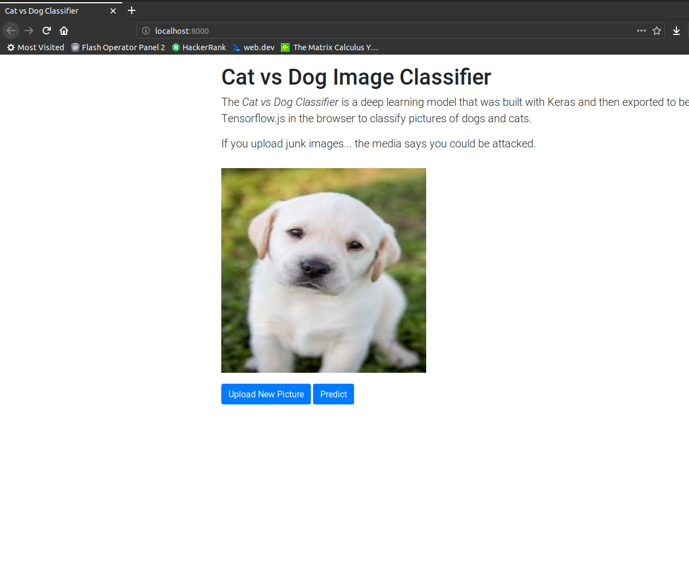

# Cat vs Dog Image Classifier with Tensorflow.js
Classify a dog or cat image inside any browser. The classifier uses a pre-trained model built with Keras that was then exported to Tensorflow.js. 

<!--  -->

## Getting Started
- `git clone https://github.com/bigdatasg/WoofOrMeow.git`
- `cd WoofOrMeow`
- Install extension: `Live Server` by *ritwickdey* in Visual Studio Code
- Right click on your html file and chose `Open with Live Server`
    - The app opens in your default browser.
    - Link to your app: [localhost:8000](http://localhost:8000/)

## Built With

* [Tensorflow.js](https://www.tensorflow.org/js)
* [Keras](https://www.tensorflow.org/guide/keras)
* [Twitter Bootstrap](http://getbootstrap.com/)

## License

This project is a modified derivative of a project that is licensed under the MIT License - see the [LICENSE.md](LICENSE.md) file for details.

